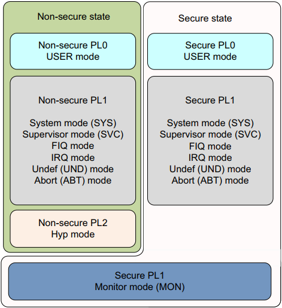

# 《ARM® Cortex®-A 系列程序员指南》读书笔记

[toc]

## 1.概述

ARMv8-A是面向应用领域的最新一代ARM架构。ARMv8包括32位和64位两种运行状态（*execution states*)，其引入了使用64位寄存器执行的能力，同时提供了向后兼容运行ARMv7软件的机制。

ARMv8-A的64位运行状态通常称为AArch64，32bit运行状态称为AArch32。AArch32与ARMv7几乎完全相同。

使用64位处理器会有以下的性能变化：

* A64指令集可以提供显著的性能优势以及更大的寄存器池。在调用函数需要传递超过4个参数时，更多的寄存器和AAPCS可实现性能的提升，因为ARMv8最多可以使用寄存器传递8个参数，而ARMv7则需要使用栈传递参数。
* 更宽的整型寄存器可以更高效的操作64位数据。32位处理器在执行64位数据的算法操作时可能需要数个步骤，而64位处理器可能只需要一步，但通常在执行32位操作时速度相同。因此64位处理器在执行大量64位操作时明显更快。
* 64位处理器可以使应用获得更大的虚拟地址空间。虽然ARMv7中可以使用LPAE将物理地址从32位扩展到40位，但虚拟地址空间并没有得到扩展，因此即便使用LPAE，单个应用可使用的地址空间依然是4GB以内。
* 软件在32位架构上运行时可能需要将数据映射进内存或取消映射。当有更大的地址空间和64位指针时可以避免这个问题。但使用64位指针会造成内存更多的消耗，因为存储64位指针需要8个字节，而32位指针只需要4字节。此外，内存空间使用率的增加会导致Cache命中率降低，反而降低性能。

## 2.ARMv8-A架构与处理器

ARM架构诞生于1985年，并还在不停的演变进化中。ARM内核的每一次进步都伴随着新特性与功能的增加，如今ARM架构已经取得了巨大的发展。

* ARMv4及更早架构
* ARMv4T
* ARMv5TE
* ARMv6
* ARMv7A

### 2.1 ARMv8-A

ARMv8-A是面向应用领域的最新一代ARM架构。其包括32位和64位两种运行模式，在引入了64位运算能力与寄存器的同时可以向后兼容ARMv7架构软件。


ARMv8-A引入了多项改进，从而使开发者可以设计出更高性能的处理器。

* 更大的物理地址空间：使处理器可以访问4GB以上的物理内存
* 64位虚拟地址空间：使虚拟地址空间可以突破4GB的限制。这对使用内存映射文件IO及稀疏寻址（*sparse addressing*）的现代桌面和服务器软件尤为重要
* 自动时间信号（*Automatic event signaling*）：可以实现低功耗、高性能的自旋锁
* 更多的寄存器：31个64位通用寄存器，从而提高性能，减少栈的使用
* 高效的64位立即数生成：减少文字池[^ 1]（*literal pools*）的使用
* 更大的PC寄存器寻址范围（*PC-relative addressing*）:+/- 4GB的寻址范围，可在共享库和与位置无关的可执行文件中进行有效的数据寻址
* 新增16KB和64KB页表粒度：降低TLB未命中率和页表查询深度
* 新的异常模型：降低操作系统和hypervisor复杂度
* 高效的Cache管理
* 硬件加速加解密：速度可达到软件加密的3-10倍
* Load-Acquire, Store-Release指令：为C++11，C11，Java内存模型设计，通过消除显式的内存屏障指令来提高线程安全（*thread-safe*）代码的性能
* NEON double-precision floating-point advanced SIMD

## 3.ARMv8基本原理

ARMv8具有4个异常等级（*Exception levels*）。在AArch64中，异常等级决定了特权等级，即软件运行在ELn则权限对应为PLn。n越大则权限越高，n越小权限越低。软件对特权等级的典型应用如下：

| 异常等级 |          运行的软件          |
| :------: | :--------------------------: |
|   EL0    |         普通应用软件         |
|   EL1    |         操作系统内核         |
|   EL2    |          Hypervisor          |
|   EL3    | 底层固件，包括Secure Monitor |


通常情况下，应用软件、操作系统内核、hypervisor分别占据一个异常等级，而内核中的hypervisor可以跨EL2和EL1运行，例如KVM。

ARMv8-A提供两种安全状态：安全态与非安全态（*Secure and Non-secure*）。非安全态也被称为*Normal World*，其可以使操作系统与可信操作系统（*trusted OS*）并行运行在同一硬件上，并能针对某些软件或硬件攻击提供保护。利用ARM的TrustZone技术，可以把系统划分为安全和非安全两个世界。与ARMv7-A架构一样，Secure monitor充当安全与非安全世界切换的"网关"（*gateway*）。

### 3.1 运行状态

ARMv8-A架构定义了AArch64和AArch32两种运行状态。AArch32保留了ARMv7的权限等级定义方法，而AArch64的权限等级由异常等级决定，因此ELn即对应PLn。

处理器在AArch64状态时使用A64指令集，AArch32状态时使用A32或T32（Thumb）指令集。

AArch64和AArch32的异常等级结构图如下所示，需要注意的是，可信OS在AArch32状态时运行在==“Secure EL3”==，在AArch64时运行在“Secure EL1”[^2]。


### 3.2 异常等级的改变

在ARMv7架构中，处理器的模式（*mode*）可通过软件在特权模式下改变或在发生异常时自动改变。ARMv7处理器的模式如下图所示：




异常等级的变化需要遵守以下规则：

* 提升到更高的异常等级意味着提升了软件的运行权限，例如从EL0提升到EL1
* 异常不能被比当前低的异常等级接管
* EL0不能处理异常，只能由更高的异常等级处理
* 异常会导致程序流程的改变，异常处理程序从异常向量表的对应入口处开始执行，异常包括：
  * 中断，例如IRQ和FIQ
  * 内存系统中止（*abort*）
  * 未定义指令
  * 系统调用
  * Secure monitor或hypervisor软中断（*traps*）
* 异常处理程序结束并返回之前的异常等级需要执行ERET指令
* 从异常中返回可以保持异常等级不变或进入较低的异常等级，不能进入更高的异常等级
* 安全状态并不随着异常等级的变化而变化，除了从EL3返回到非安全状态，请参考17.8

### 3.3 运行状态的改变

有时切换运行状态是必要的。例如，系统运行的是64位操作系统，而想在EL0上运行32位的应用程序。此时就需要将系统切换到AArch32状态，当程序运行结束或需要返回操作系统执行时，系统可切换回AArch64。需要注意的是，以AArch32状态运行的操作系统上不能运行64位的应用程序。如下图所示：


要在同异常等级上切换运行状态，必须先切换到更高的异常等级，再返回原异常等级。例如，在64位操作系统上运行32位和64位应用程序，32位程序可通过SVC指令或中断切换到AArch64 EL1，然后操作系统可以进行任务切换并返回到AArch64 EL0运行。实际上这也意味着无法将32位和64位程序混用，因为它们之间无法进行直接调用。

运行状态的切换只能在异常等级切换时进行。EL3是最高的异常等级，因此其无法切换运行状态，除非通过复位。

> 即异常等级降低时，AArch32不能切换为AArch64；异常等级升高时，AArch64不能切换为AArch32。:beer:

以下是AArch64和AArch32切换时的一些要点总结：

* AArch64和AArch32的异常等级类似，但在安全或非安全态时的有一些差别。产生异常时处理器的运行状态会限制其他运行状态的可用异常等级[^3] PS：想准确翻译原文真的好难……:weary:
* 想要切换到AArch32需要从较高的异常等级降低到较低的异常等级。需要在异常处理退出时使用ERET指令实现
* 想要切换到AArch64需要从较低的异常等级提高到较高的异常等级。可通过指令或外部中断实现
* 如果在进入异常或从异常返回时异常等级没有改变，则运行状态也无法改变
* 当ARMv8处理器在某一异常等级以AArch32状态运行时，对进入该异常等级的异常采用与ARMv7相同的异常模型。以AArch64状态运行时使用AArch64异常模型

高异常等级运行在AArch64状态时可以支持低异常等级使用AArch64或AArch32，而高异常等级使用AArch32则低异常等级也只能使用AArch32。处理器实现的最高异常级别在运行时运行状态无法改变，只能通过复位处理器时更改。

## 4.ARMv8寄存器

AArch64提供了31个64位通用寄存器X0-X30，可在所有异常等级随时访问。这些寄存器还有32位格式，称为W0-W31，对应64位寄存器的低32位。


读取W*n*寄存器时忽略X*n*的高32位；写W*n*寄存器时将X*n*的高32位置0，例如写W0写入0xFFFFFFFF后，X0的值为0x00000000FFFFFFFF。

### 4.1 AArch64的特殊寄存器

除了31个通用处理器外，AArch64还有一系列的特殊寄存器，如下如所示：


#### 4.1.1 Zero寄存

读Zero寄存器永远返回0，向Zero寄存器写值会被忽略

#### 4.1.2 SP寄存器

每个异常级别都有自己的栈指针寄存器，如SP_EL0，SP_EL1，SP_EL2和SP_EL3。在AArch64状态下，处理器在高于EL0的异常等级中可以使用该等级栈指针寄存器SP_EL*n*，也可以使用SP_EL0，而EL0只能使用SP_EL0。

通常情况下，处理异常时使用目标异常等级的栈指针寄存器，例如当在EL1处理异常时就使用SP_EL1。

> ARM手册中会有类似EL1*t*或EL1*h*的写法，*t*后缀表示使用SP_EL0，而*h*表示使用SP_EL*n*。

#### 4.1.3 PC寄存器

在ARMv7中，PC可作为通用寄存器（R15）使用，可以在编程时使用一些巧妙的编程技巧，但却为编译器和复杂的流水线设计带来了麻烦。ARMv8中已经不能直接访问PC寄存器，这样使返回预测（*return prediction*）更加容易，同时简化了ABI规范。

不能将PC寄存器作为数据处理或加载指令的目的寄存器，PC只能通过某些指令隐式的使用，例如与PC相关的加载或地址生成指令。

#### 4.1.4  ELR寄存器(Exception Link Register)  

该寄存器用于保存异常返回地址

#### 4.1.5 SPSR寄存器（Saved Process Status Register  ）

产生异常时，处理器的状态（PSTATE）保存在对应的SPSR_EL*n*寄存器中；异常返回时SPSR中的值会恢复到PSTATE中。发生异常时处理器进入EL*n*，则PSTATE保存在SPSR_EL*n*中。


### 4.2 处理器状态

与ARMv7不同，AArch64不再提供CPSR寄存器，而是将CPSR中的字段变为多个寄存器，可以独立访问，这些寄存统称为PSTATE（*Processor State*）。

在AArch64状态下使用ERET指令从异常返回时，SPSR_EL*n*将会拷贝到PSTATE中，且处理器会从ELR_EL*n*处开始执行。在EL0中只能访问PSTATE的N，Z，C，V字段，其他字段只能在EL1或更高异常等级中访问。


### 4.3 系统寄存器

在ARMv7及之前的架构中都是使用CP15协处理器对处理器进行配置，而AArch64中取消了协处理器的概念，转而使用系统寄存器（System register）。

系统寄存器中带有后缀*_ELn*的，说明其在各异常等级中存在影子寄存器（Banked），后缀也指明了访问该寄存器所需要的最低异常等级。例如TTBR0_EL1可在EL1、EL2和EL3访问，TTBR0_EL2只能在EL2和EL3访问。

访问系统寄存器使用MSR和MRS指令，例如：

```c
MRS x0, TTBR0_EL1    //x0 = TTBR0_EL1
MSR TTBRO_EL1, x0    //TTBR0_EL1 = x0
```

#### 4.3.1  SCTLR寄存器（System Control Register）

SCTLR寄存器用于控制内存系统、系统功能以及提供状态信息。

访问SCTLR寄存器同样是使用MRS和MSR指令，例如：

```c
MRS X0, SCTLR_EL1      //X0 = SCTLR_EL1
ORR X0, X0, #(1 << 2)  //X0 = X0 | 0x4 即C位置1，使能数据Cache
ORR X0, X0, #(1 << 12) //X0 = X0 | 0x1000 即I位置1，使能指令Cache
MSR SCTLR_EL1, X0      //SCTLR_EL1 = X0
```

需要注意，在任何异常等级中使能数据和指令Cache前都需要先进行无效Cache的操作。PS:举个例子都要贴心的提醒你必须先无效Cache……😅

### 4.4 字节序

数据在内存中两种存储方式，分别为大端和小端。大端模式将数据的最高有效字节存储在最低地址；而小端则将数据的最低有效字节存储在最低地址。AArch64状态下，数据访问可配置为大端或小端，指令获取只能为小端。

各异常等级的字节序通过SCTLR_EL*n*.EE位单独控制，EL0的字节序通过SCTLR_EL1.E0E位控制。

### 4.5 寄存器角度的运行状态改变

当使用AArch32的较低异常等级发生异常，进入使用AArch64的较高异常等级时：

* AArch32中可访问的寄存器的高32位是UNKOWN状态
* AArch32中不可访问的寄存器保持AArch32运行前的状态不变
* 当EL2使用AArch32，产生异常进入EL3，则ELR_EL2的高32位是UNKNOWN状态
* 在AArch32状态下不能访问该异常级别AArch64状态下的SP和ELR寄存器，这些寄存器保持AArch32运行前的状态不变，该规则适用于SP_EL0，SP_EL1，SP_EL2，ELR_EL1。

#### 4.5.1 AArch32中的寄存器

AArch32与ARMv7架构几乎相同，使用的寄存器模型也与ARMv7一致。ARMv7有R0-R15共16个通用寄存器，其中R13作为SP使用，R14作为LR使用，R15作为PC使用。软件可以访问CPSR寄存器，产生异常时CPSR的值会保存在处理该异常的模式的SPSR_*mode*寄存器中。每个模式都有数个影子寄存器，因此处理器所处的模式决定了软件可以访问哪些寄存器。


AArch32的大部分寄存器其实都映射在AArch64的寄存器上。映射关系如下图所示：


[^ 1]: literal pool是ARM汇编语言代码节中的一块用来存放常量数据而非可执行代码的内存块。Literal pools are areas of constant data in a code section。可参考《ARM Compiler armcc User Guide》
[^2]: ARMv8使用AArch32时的情况较为复杂，请参考ARMv8架构手册G1.7
[^3]: 参考ARMv8架构手册G1.9.1，EL3使用AArch64或AArch32会影响安全状态下处理器模式所处的异常等级。